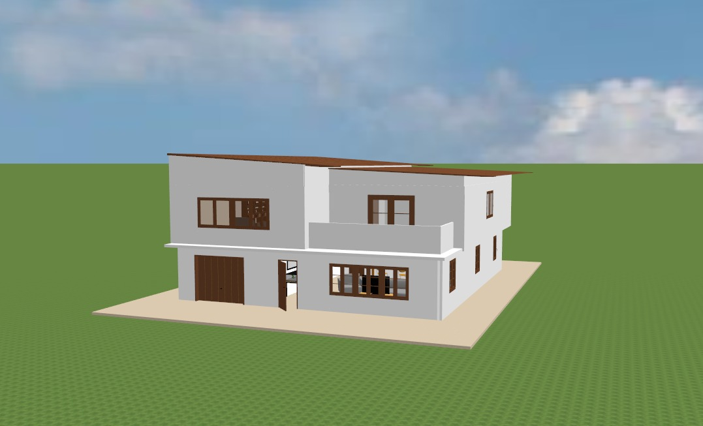
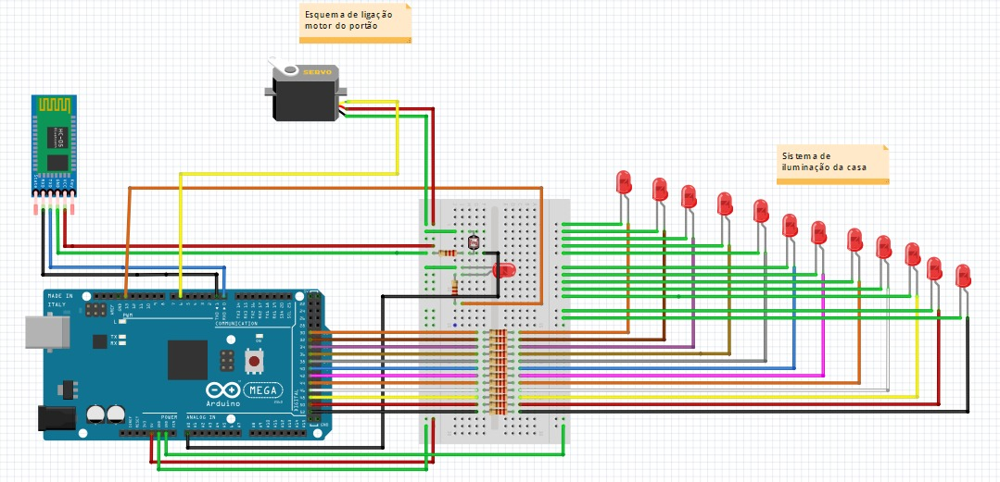

  <h2 align="center">Casa Automatizada</h3>
  
  

  

  

    Uma forma de melhorar a usabilidade da sua casa.
     
    

## Sobre o Projeto
 

 

Projeto desenvolvido como Trabalho de conclusão de curso (TCC) do curso Técnico de Eletrotécnica da instituição Centro Paula Souza (ETEC) com o principal tema o desenvolvimento de uma residência automatizada, permitindo o controle da iluminação em todos os seus ambientes e a operação dos portões através de um dispositivo smartphone.

## Tecnologias

- C++
- Arduíno
- Arduíno IDE
- Fritzing

## Exemplo de Uso

- Controle de Iluminação:

  - Ajuste da intensidade da iluminação em diferentes áreas da residência usando um smartphone.
  - Programação de horários específicos para ligar e desligar as luzes automaticamente.
- Operação de Portões:

  - Abertura e fechamento dos portões da residência por meio de comandos via smartphone.
  - Integração com sistemas de segurança, permitindo a abertura remota para visitantes autorizados.

## Contato

Gustavo Cazetta de Oliveira - gustavocazetta@gmail.com

